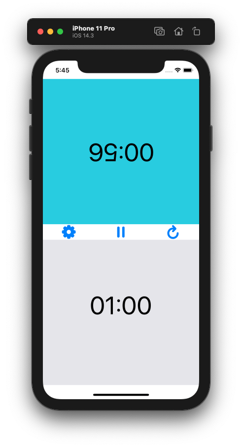

# ChessTimer

I built a chess timer app because I take too long to make a move and no one wants to play with me any more.

### Starting screen, with options to set, pause, and restart time

### Active player in blue as the time counts down

### Choose your time

### When time runs out, the screen turns red

